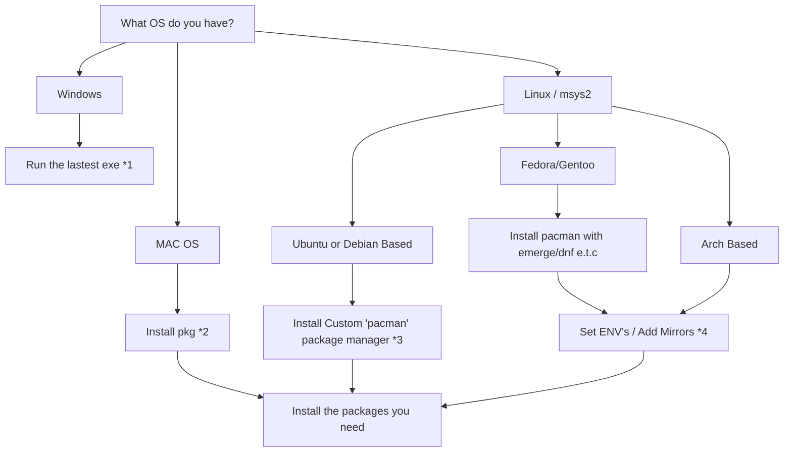

# Pokecom Channel

This project contains two channels. 

1. Main Pokecom Channel
2. A test channel with minimal networking code, no ui, printf to screen and fewer dependencies. 

In the Main channel debug logs are limited to the logging UI which can be accessed with the minus button on the wii remote.

## Build

1. Install devkitpro (https://devkitpro.org/wiki/Getting_Started)
2. Install all the various wii development packages** like `libogc` (if you get a build error you're probably missing a package). 
3. `cd PokecomChannel`
4. `make`

**Here is a list of packages I had to install to make it work (I don't know if all of these were required)
```
devkit-env 1.0.1-2 (gp32-dev gba-dev nds-dev 3ds-dev gamecube-dev wii-dev wiiu-dev switch-dev)
    environment settings for devkitPro supplied tools
devkitARM r62-1 (gp32-dev gp2x-dev gba-dev nds-dev 3ds-dev)
    Toolchain for gp2x, gp32, Nintendo gba, nds, dsi, (3)ds & switch homebrew development
devkitARM-gdb 13.2-1 (gp32-dev gba-dev nds-dev 3ds-dev)
    gnu debugger for devkitARM
devkitarm-cmake 1.2.1-1 (gp32-dev gp2x-dev gba-dev nds-dev 3ds-dev)
    CMake support files for devkitARM
devkitarm-crtls 1.2.2-1 (gba-dev gp32-dev nds-dev 3ds-dev)
    devkitARM crtls.
devkitarm-rules 1.5.1-1
    devkitARM build rules.
devkitpro-keyring 20180316-1
    devkitPro PGP keyring
dkp-cmake-common-utils 1.5.1-1
    Common utilities and infrastructure for devkitPro CMake
devkitPPC r44-1 (gamecube-dev wii-dev wiiu-dev)
    Toolchain for Nintendo Gamecube & Wii homebrew development
devkitppc-rules 1.2.1-1 (gamecube-dev wii-dev wiiu-dev)
    devkitPPC build rules.
gamecube-tools 1.0.3-1 (wii-dev gamecube-dev)
    gamecube tools
general-tools 1.4.4-1 (gp32-dev gp2x-dev gba-dev nds-dev 3ds-dev switch-dev gamecube-dev wii-dev wiiu-dev)
    Tools for homebrew development
libfat-ogc 1.2.0-1 (wii-dev gamecube-dev)
    Nintendo Wii & Gamecube FAT library.
libogc 2.4.1-1 (wii-dev gamecube-dev)
    Nintendo Gamecube & Wii library.
ppc-libpng 1.6.39-3 (ppc-portlibs)
    PNG format graphic files library (for Nintendo Gamecube/Wii homebrew development)
wii-sdl 1.2.15-10 (wii-portlibs wii-sdl-libs)
    A library for portable low-level access to a video framebuffer, audio output, mouse, and keyboard (Nintendo Wii port)
```

If you have issues see the troubleshooting step***

## Debugging

On the wii channel main screen you can press `minus` for some debug info.

A debug version of the channel is available that prints out messages to the screen. Alternatively you can compile the UI channel with `#define USE_UI TRUE` set to false in `main.cpp`

## Resolving Addresses

The channel can only connect to TCP servers that have an available ipv4 address. However as of version v0.1.1 the channel will try and resolve domain names to an ipv4 if they are passed from the rom. Here are a couple of examples of addresses that could be passed from the rom and the channel should work with:

- 127.0.0.1:9000
- example.com:8089 (> v0.1.1)

The character limit for these addresses (including port) is 32 characters. 

Ip addresses can be tested from the `Network Config` menu within the channel. However this can cannot currently be used to test domain names. If you want to check the domain name is working from a linux machine you can run a command like `getent ahosts example.com`. Note that if multiple ipv4 addresses are returned in the address list then it will always pick the first one.

When you test a connection in the `Network Config` and it is successful all NEW gba connections will be sent to that address. However if the gba has already tried to make a connection (using config passed from the rom) then the config passed from the rom will still be used (even if it never made a successful connection). i.e if the channel still stays 'Waiting' rather than the player name the connection can be overriden. If it shows the player name the connection cannot be changed without restarting the channel.

##  Banner / WAD editing

To create/modify the wad you can use CustomizeMii (https://wiibrew.org/wiki/CustomizeMii) [customizemii 3.11-1]

To modify banner animations you can use Benzin (https://github.com/HACKERCHANNEL/benzin)

TODO: as there are no in-date instructions on these tools I should probably make some sort of guide

## Converting audio

The following command can be used to convert and mp3 to a pcm. 
This may alter the speed, it's easiest just to modify the mp3 speed before conversion to compensate. 


`ffmpeg -i connecting.mp3 -f s16le -acodec pcm_s16be connecting.pcm`

## ***Build Troubleshooting - aka,  It's been hours and I still can't compile anything for wii

Let's start from the beginning. 

#### What is it devkitPro?

devkitPro provides various packages for compiling code for gba,nds,3ds,gamecube,wii,wii and switch code. On windows there is an executible installer that installs these packages. On macos/linux there is a package manager (like a software store) that let's you install the packages you need.

#### So how do I get it?



*1 - https://github.com/devkitPro/installer/releases

*2 - https://github.com/devkitPro/pacman/releases/tag/v6.0.2 instrucitons at (https://devkitpro.org/wiki/devkitPro_pacman)

*3 - https://devkitpro.org/wiki/devkitPro_pacman#Debian_and_derivatives

*4 - https://devkitpro.org/wiki/devkitPro_pacman#Customising_Existing_Pacman_Install

#### Now make sure you have the right packages

On windows there is a graphical package manager. On everything else you now have to install what you need with pacman. You can see a list of all the packages I had to install in the build section. But if you get errors running `make` then it's probably due to missing packages and googling the error will give you an idea of the package you are missing.

I recommend trying to build a few of the examples (https://github.com/devkitPro/wii-examples) to make sure everything is working correctly. 

#### I have all the packages I need, so now there should be no more issues, right? ....... right?

If you are building this in the future you may have later versions of the packages than I was using. When getting everything to work I encountered several where a function from one of the libraries had changed name or now worked differently. 

You may be wondering how to downgrade to versions of the packages I was using... here's the neat thing, you don't.... or rather can't really. devkitPro manages making sure the version of packages you have are compatible with each other. Technically you could find all the versions of packages I was using but 99% of the time it's going to be quicker work out which part of the code needs changing to make things build. 

This is one of the reasons I also include the 'No UI' version of the channel. It has far fewer dependencies (as it doesn't use libwiigui). I recommend trying to get that working first, then trying to get the UI version working. Good luck. 

## Licence 

The Pokecom Channel uses libgui 1.06 (https://github.com/dborth/libwiigui) and is therefore licenced under GPL-3. 

The NoUITestChannel shares the MIT licence with the other projects.

## Resource Attribution

All graphics in the project are either part of libwiigui or created by me.

The following audio files are are from pixabay.com with the free non-commercial licence
- intro.wav (the banner screen jingle)
- connecting.mp3 
- fail.mp3
- keystroke.mp3
- success.mp3
- swish.mp3

The main background audio loop (bg_music.mp3) is the royalty free track 'Farty Mcsty' by Eric Matyas
(https://soundimage.org/)

