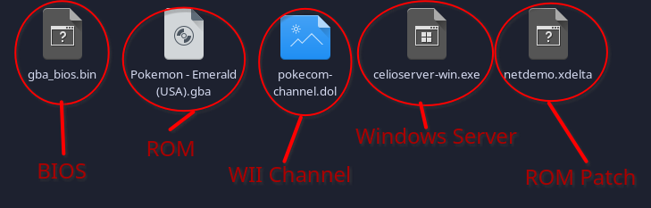

⚠️ This project has mostly been tested on dolphin, use on real hardware at your own risk. ⚠️

> This project is in development. While it should be functional this version is only intended for use by developers. Feel free to contribute. 

# Emerald Net Demo

This project aims to add a network connection into Pokemon Emerald, using only official hardware. With some demos and a web server to test things.

## Current Demos

Several features are included to showcase the network conectivity. These crrently include:

- Returning a welcome message to display in game when connecting to the server
- Downloadable EReader Style Battles. Through the Web UI, choose 3 pokemon, nicknames, held items, moves and levels.
- Random Trades. Randomly trade with another person connected to the server.
- Downloadable Mart. Through the Web UI, pick up to 6 items for the mart to sell.
- Downloadable Gift Egg. Through Web UI choose the pokemon and allow it to have a special move. Users can only download each egg once. 

## Network Diagram

```mermaid
sequenceDiagram
    participant 🎮 GBA
    participant 📺 WII
    participant 🌐 TCP SERVER
    🎮 GBA->>📺 WII: DOL-011 Cable
    Note over 🎮 GBA,📺 WII: (JOYBUS)
    📺 WII->>🌐 TCP SERVER: WIFI
    Note over 📺 WII,🌐 TCP SERVER: (TCP)
    🌐 TCP SERVER->>📺 WII: WIFI
    Note over 🌐 TCP SERVER,📺 WII: (TCP)
    📺 WII->>🎮 GBA: DOL-011 Cable
    Note over 📺 WII,🎮 GBA: (JOYBUS)
```

## Requirements

There are two ways to get this project running:

- Dolphin (For PC) *(Version 5 or higher is recommended as this has the built in GBA link support)*  
- A PC/Server that can run nodejs 

### - OR -

- GBA or GBA SP (https://en.wikipedia.org/wiki/Game_Boy_Advance)
- Flash cart for custom games (https://en.wikipedia.org/wiki/Flash_cartridge)
- DOL-011 cable (https://en.wikipedia.org/wiki/GameCube_%E2%80%93_Game_Boy_Advance_link_cable)
- WII *(Not wii mini)* (https://en.wikipedia.org/wiki/Wii)
- WIFI Router or Wii ethernet adapter
- A PC/Server that can run nodejs 

## Software Components

There are 3 main components to this project:

- A modified version of pokeemerald with a collection of network functions for reliable communication with the Wii
- A homebrew Wii channel allowing up-to 4 GBA's to connect to the server (per wii)
- A NodeJS Server, with TCP Server for game connections and a Webserver for providing a UI for configuring the server

You can download a zip of the latest releas build here https://github.com/KittyPBoxx/pokeemerald-net-demo/releases

## Quick Start

### 1 - Get all the resources

See the 'requirements' section for all the software/hardware you can use. You also need the release zip which contains three programs.

- Celios Server, (for windows/mac/linux) that you can run as an executable
- The pokemon emerald xdelta patch that can be applied to your copy of pokemon emerald
- Pokecom Channel, both the WAD and .dol are included. So you can install the WAD as a channel or just run the .dol (whichever you prefer)

On top of these you will need

- Your Pokemon Emerald (U) backup rom\g
- A GBA bios.bin file

### 2 - Patching Emerald

- Get your copy of Emerald (U). (md5sum 605b89b67018abcea91e693a4dd25be3) 
- Get the netdemo.xdelta from the release zip
- Use this site to patch your rom. https://www.marcrobledo.com/RomPatcher.js/

### 3 - Configure Dolphin 

  - Get Dolphin >= 5, (the android release will not work as it dosn't support gba connections)

Configure the following settings

  - Open Controllers and select integrated GBA controller
  - Settings->Wii | aspect ratio should be 4:3
  - Settings->Gamecube | Load the gameboy bios.bin  
  - Settings->Gamecube | the pokeemerald rom is loaded in same port as the integrated GBA controller you are using
  - If using an exsiting save the name is updated. i.e if your rom is pokeemerald.gba and you are in port 1 the save would be called 'pokeemerald-1.sav'

The easiest way to run the wii channel is just to drag and drop the 'pokecom-channel.dol' file into dolphin.

> If you are running on a real wii, copy the whole PokecomChannel folder (including, the dol, icon.png and meta.xml) to the `apps` folder on your sd card and launch through homebrew

### 4 - Run the server

To locally host a server in windows double click on celioserver-win.exe or run it from the command line.

Once it is running you can go to the web ui by going to `localhost:8081` in your web browser

The game server runs at localhost:9000 so dolphin should automatically be able to connect if they are running on the same PC

> If you can't run a server yourself you can configure the wii channel to connect the the public test server `130.162.161.228:9000`. Be aware this is a test environment an may go offline or be unstable.

### 5 - Play the game
  
* When the wii channel launches the integrated mgba should launch at the same time
* If the wii channel does not detect the game automatically, right click the mgba window on the game screen, reset the game, and it should be picked up
* The player in the wii channel will show as "Waiting" untill you talk to the terminal at the Lilycove Network Center
* If you are starting a new save, Norman will be waiting in Oldale to take you to Lilycove. Once there head to the North-Eastern building and speak to the terminal.

## Dev Guide 

Dev info for each of the projects can be found their project folders:

[Poke Emerald (GBA)](pokeemerald/README.md)

[Celio Server (Web Server)](CelioServer/README.md)

[Pokecom Channel (Wii)](PokecomChannel/README.md)
