⚠️ This project has mostly been tested on dolphin, use on real hardware at your own risk.  ⚠️

> This project is in development. While it should be functional this version is only intended for use by developers. Feel free to contribute. 

# Emerald Net Demo

This project aims to add a network connection into Pokemon Emerald, using only official hardware.

## Current Demos

Several features are included to showcase the network conectivity. These crrently include:

- Returning a welcome message to display in game when connecting to the server
- Downloadable EReader Style Battles. Through the Web UI, choose 3 pokemon, nicknames, held items, moves and levels.
- Downloadable Mart. Through the Web UI, pick up to 6 items for the mart to sell.
- Downloadable Gift Egg. Through Web UI choose the pokemon and allow it to have a special move. Users can only download each egg once. 

```mermaid
sequenceDiagram
    participant 🎮 GBA
    participant 📺 WII
    participant 🌐 TCP SERVER
    🎮 GBA->>📺 WII: DOL-011 Cable
    Note over 🎮 GBA,📺 WII: (JOYBUS)
    📺 WII->>🌐 TCP SERVER: WIFI
    Note over 📺 WII,🌐 TCP SERVER: (TCP)
    🌐 TCP SERVER->>📺 WII: WIFI
    Note over 🌐 TCP SERVER,📺 WII: (TCP)
    📺 WII->>🎮 GBA: DOL-011 Cable
    Note over 📺 WII,🎮 GBA: (JOYBUS)
```

## Requirements

There are two ways to get this project running:

- Dolphin (For PC) *(Version 5 or higher is recommended as this has the built in GBA link support)*  
- A PC/Server that can run nodejs 

### - OR -

- GBA or GBA SP (https://en.wikipedia.org/wiki/Game_Boy_Advance)
- Flash cart for custom games (https://en.wikipedia.org/wiki/Flash_cartridge)
- DOL-011 cable (https://en.wikipedia.org/wiki/GameCube_%E2%80%93_Game_Boy_Advance_link_cable)
- WII *(Not wii mini)* (https://en.wikipedia.org/wiki/Wii)
- WIFI Router or Wii ethernet adapter
- A PC/Server that can run nodejs 

## Software Components

There are 3 main components to this project:

- A modified version of pokeemerald with a collection of network functions for reliable communication with the Wii
- A homebrew Wii channel allowing up-to 4 GBA's to connect to the server (per wii)
- A NodeJS Server, with TCP Server for game connections and a Webserver for providing a UI for configuring the server

## Instructions *(Very breif instructions for testing, I'm working on the Dev and User docs)*

1. Build the pokeemerald project
2. In Dolphin >= 5, go to controllers and select integrated GBA controller (or TCP controller if you are using external mgba) 
3. Make sure the following config is set in dolphin:
  * settings->wii | aspect ratio is set to 4:3
  * settings->gamecube | a gba bios is loaded  
  * settings->gamecube | the pokeemerald rom is loaded in same port as the integrated GBA controller you are using
  * If using an exsiting save the name is updated. i.e if your rom is pokeemerald.gba and you are in port 1 the save would be called 'pokeemerald-1.sav'
3. Run the Pokecom channel .dol or install the channel WAD (with load wii system menu, then install WAD)
4. Run Celio Server application with `npm run start`, and load the web UI by going to localhost:8081 in a browser
5. Restart the GBA so that the Pokecom channel will detect it. The network config is stored in the game but can be overriden on the wii. By default it will connect at localhost:9000 (set in net_conn.c) so make sure dolphin and the server are running on the same machine
6. Start the game and get to Oldale. There you can talk to Norman who will take you to Lilycove where you can visit the network center a new building. Inside talk to the computer terminal on the left to get connected, then enter the back room to try the network demos  